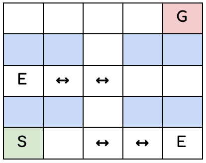

# Milestone 1

### Brief Description of DSL

Pacman:
- The goal of the game is to reach a “fruit” inside of the maze while avoiding getting hit by the enemies.
- Allow players to modify values that affect how the ghost/enemies move over time. Essentially, we get dynamic enemies (allow players to vary movement speed of ghosts, perhaps make the ghost move in a specific pattern every time etc.)
- Other minor changes the player can make might include:
  - Add their own images for the enemies/background/fruit/player
  - Potentially add their own BGM (?)

### Feedback/Changes from TA

- Has a lot of potential and is an interesting idea, but might be too ambitious.
- Without the background of knowing how to make 2D games, it may be too difficult.
  - However, if we borrow and cite the assets we use for the game, it shouldn’t be too difficult to implement.
- DSL wise it's perfect, allows user to write different scenarios, speed, collision, etc.

### Follow-up tasks/Features still to design

- We can also allow players to create their own maze. They can specify certain patterns that might repeat, or just individually place walls in order to create the maze.
- Investigate potential graphic APIs.

# Milestone 2

### Division of Responsibilities

- Language Development: Olivia, Elias, Brendan
  - Input definition:
    - define what we will let the user input to accomplish the actions we are allowing them (in this case, create game screen, enemies, difficulty of enemies etc.)
  - Tokenization
    - Decide tokens
      - Fixed and User-Defined Literals
    - Design and implement tokenization
  - Grammar
    - Create grammar
    - Check for correct grammar patterns
  - Parsing
    - Design and implement parsing
  - Validation
    - Design and implement validation
  - Evaluation
    - Test out program
      - In our context, this will essentially be generating a game artifact, with all visualization displayed correctly and the game behavior fully functioning (both UI and functionality)
      - We will create an AST, and recursively evaluate all child nodes (Interpreter Pattern)  OR try the Visitor Pattern, depending on which applies etter with our implementation. 
- UI & Graphics Design/Development: Brendan, Hee Ran, Jose
  - Java API research: Jose
    - Determine tools and APIs to be used by the DSL
  - User Control: Jose
    - “Arrow-Key” character movement
  - Simple menu
    - Ability to start/stop/pause game
  - Enemy AI: Jose
    - Follow/track player
    - Spawning
  - Acquiring assets
    - Characters: User, Enemies
    - Items
    - Background/maze
  - (Possible) dynamic maze creation
  - Testing: Hee Ran
- User Studies: Olivia, Brendan
- Video Creation: Jose
  - Content
    - User studies information
    - Sample clips of implemented DSL
    - Narration
  - Editing

### Timeline
| Date           | To Be Completed | To Begin |
| -------------- | --------------- | -------- |
| September 25th | <ul><li>Milestone 2</li><li>Set timeline</li><li>Task division</li></ul> | <ul><li>API Research</li><li>First user studies</li><li>Language design</li><li>Implementation of language (tokenizer, basic evaluator)</li></ul> |
| October 2nd    | <ul><li>Milestone 3</li><li>Mockup of concrete language design (based on first user study)</li><li>Initial user studies</li><li>Changes to original language design</li></ul> | <ul><li>Language evaluation & redesign</li><li>Start on the 3-min video</li></ul> |
| October 9th    | <ul><li>Milestone 4</li><li>Prototype of the language </li><li>Plans for final user study</li><li>Planned timeline for the remaining days</li><li>Status of implementation</li></ul> | <ul><li>Conduct final user study</li><li>Language evaluation & redesign</li><li>Finishing touches to video</li></ul> |
| October 16th   | <ul><li>Make adjustments as necessary from final user study</li><li>Complete video</li></ul> | <ul><li>Final implementation</li></ul> |
| October 19th   | <ul><li>Testing & debugging</li><li>Optimization</li></ul> |  |

### Current Progress
- Initial mock-up/design of DSL 
- Started setting up for first User Study
- Decision to work in Java

# Milestone 3

### Mockup of the Language
SIZE(8,10)  
BUILDWALL(5,6,2,3)  
LOOP {  
&emsp; ENEMYSTART(2,3)  
&emsp; MOVE(UP, 1)  
&emsp; MOVE(RIGHT, 2)  
&emsp; MOVE(DOWN, 1)  
&emsp; MOVE(LEFT, 2)  
}  
ENEMYCOLOUR #42069  
ENEMYSPEED 1  
WALLCOLOUR #111111  
MAPCOLOUR #222222  
CHARCOLOUR #333333

### User Study Notes
For the user study, we conducted a guided case. We introduced our main goal of the language and included some graphics to make it simpler to understand.

The main task specified for the user was: 
“Your task is to write some code that will generate a maze for other players to complete. Here is a graphic of what the maze you will design will look like.

  

Here is an explanation for the graphic above.
S stands for the start. All players will begin at the bottom-left corner. In terms of x- and y- coordinates, this would be position (1,1); the first number corresponding to the x-coordinate and the second number corresponding to the y-coordinate. We will use this notation throughout the rest of the explanation.
G stands for goal. All players must reach the upper-right corner to solve the maze. In terms of x- and y- coordinates, this would be position (5,5).
E stands for enemy. You have the option of placing enemies anywhere within the maze, as long as they do not overlap with any wall, start or goal. 
The arrows next to enemies indicate their movement pattern. For example, the enemy in the bottom-right corner will move two spaces to the left and then two spaces to the right, and repeat.
The boxes highlighted blue indicate walls. Players will not be able to transverse these spots.”

After that we introduced some code snippet examples so that the user could get the intuition about how our language works and the commands available. We begin with a simple example and in a step-by-step basis walk them through how additional commands can be added on top of that simple code snippet. 

It's important to mention that our user had no background in coding. 

We asked him for feedback about ease of use, recommended changes and overall his experience with the exercise. He mentioned it was very clear and easy to understand even without having a computer science background. He mentioned based on the context of our game there is nothing he could think we could add. The user mentioned he would be interested in using something similar in his free time, which proves that our target users actually have an interest in this sort of idea. Finally, worth mentioning he was able to answer all the questions and steps correctly and without getting stuck at any point. Nothing changed in our grammar from our previous design based on his input. 

### Changes to the Original Language Design
- Decided to limit the feature for customizing asset color to the player and the enemy characters.
- Decided to let users build custom mazes using the command BUILDWALL.

# Milestone 4

### Status of Implementation
Here is a list of objectives that we want to complete over the course of the project’s timeline. The ones that have been completed are in bold.

#### Language Development
**Input Definition  
Tokenization  
Grammar  
Parsing**  
Validation  
Evaluation  

#### UI and Graphics
**Java API Research**  
User Controls  
Simple Menu  
Enemy Movement  
Acquiring Assets  
Dynamic Maze Creation  
Testing  

#### User Studies
**First User Study**  
Final User Study 1  
Final User Study 2  

#### Video Creation

### Plans for Final User Study:
For our final user study, we hope to be able to do two. If we have more time, we might even do a third one. This is because we want to guarantee that our grammar is easy enough to understand and use consistently. As for who is in charge of the final user studies, Brendan and Olivia will be.

### Planned Timeline for the Remaining Days
| Date           | To Be Completed | To Begin |
| -------------- | --------------- | -------- |
| October 9th    | <ul><li>Prototype of the language </li><li>Plans for final user study</li><li>Planned timeline for the remaining days</li><li>Status of implementation</li></ul> | <ul><li>Conduct final user study</li><li>Language validation & evaluation</li><li>Start combining UI with Implementation.</li><li>Make the video</li></ul> |
| October 16th   | <ul><li>Make adjustments to the implementation as necessary from final user study</li><li>Language validation & evaluation</li><li>Finish implementing the UI</li></ul> | <ul><li>Final implementation, optimization & debugging</li></ul> |
| October 19th   | <ul><li>Final implementation, optimization & debugging</li><li>Complete the video</li></ul> |  |